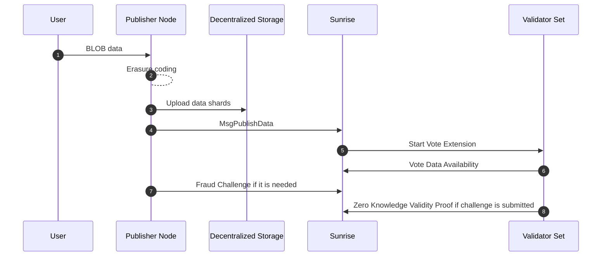
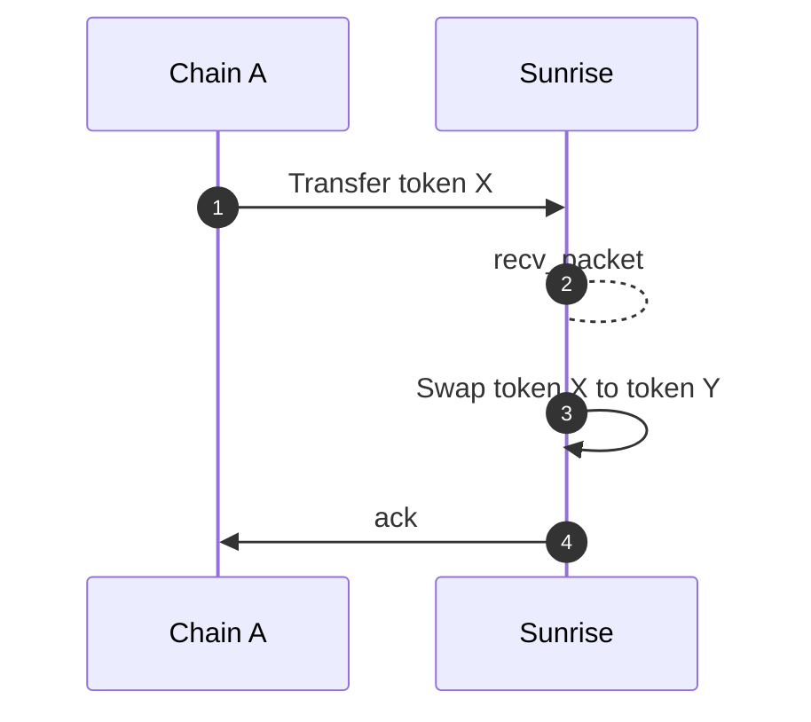
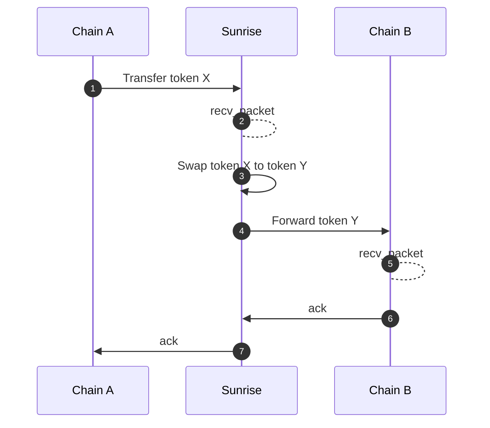
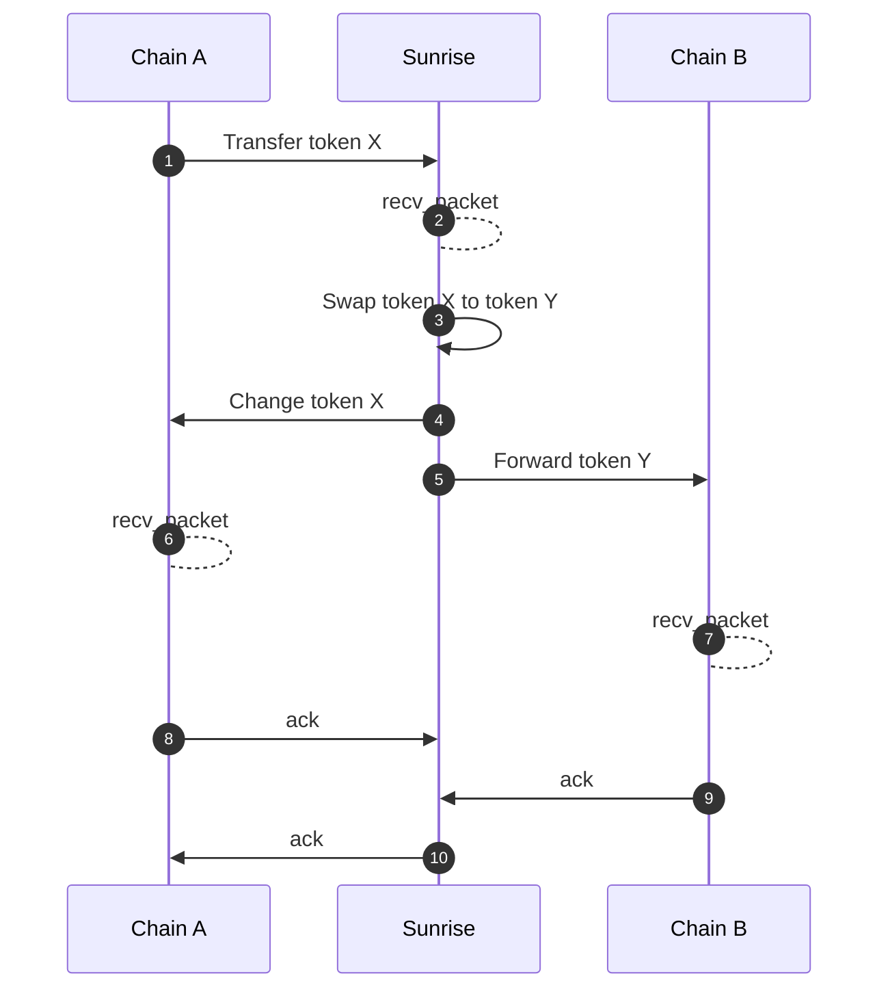

logosunrise
The Next Generation of
Liquidity and Sovereignty
Sunrise is a specialized Data Availability Layer for Proof of Liquidity.
Enhanced Liquidity for Everyone
Building with Sunrise enables the advantages & benefits of an aligned liquidity & security model by extending the Proof of Liquidity flywheel to the DA level. This bootstraps liquidity for rollups, while providing a comprehensive solution for modular blockchain development.
01
Monolithic blockchains can’t scale.
sunrise-01.label
Monolithic chains are generalist blockchains that perform all tasks themselves. The monolithic approach is to “do everything yourself”.
This approach is expensive, not customizable, and not scalable. It’s extremely slow to build and deploy modern applications directly on monolithic chains. It’s an outdated formula, ready for disruption.

02
The modular paradigm is already here.
sunrise-02.label
A modular blockchain differs from a monolithic chain in that its four main functions can each be offloaded to a separate layer.
Sunrise is an example of a blockchain that specializes in fulfilling the function of data availability (“DA”) and consensus, while offloading the responsibility of execution and settlement to individual networks.
By using this structure, Modular Blockchains are more efficient, customizable, scalable, sovereign...

03
Proof of Liquidity
sunrise-03.label
Sunrise provides a fast and secure data and consensus layer that gives you all you need to launch a sustainable modular blockchain.
Sunrise brings further innovation to the modular paradigm by integrating a novel mechanism: Proof of Liquidity (PoL).
PoL on Sunrise is Modular Liquidity, resolving the liquidity issue faced by pre-existing modular infrastructure. Extending & replicating Berachain Proof of Liquidity across the entire DA Layer creates an aligned liquidity & security model identical to Berachain’s PoL flywheel, systematically building liquidity for both Sunrise and its users.
DA users on Sunrise can now directly engage in PoL on Sunrise to bootstrap liquidity and security for their rollup.

04
DA Fee Abstraction
sunrise-04.label
Integrating PoL at the DA Layer also enables Fee Abstraction on Sunrise.
While other DA layers charge fees in their native tokens, leading to a net-value extract to rollup developers, Sunrise instead can utilize any token.
Sunrise resolves singular token dependency by allowing anyone to engage in PoL in exchange for blobspace. Users can LP to any pool of their choice, including stable pools, settlement layer tokens, and bridged tokens through our cross-chain integrations. This allows Sunrise and Sunrise’s users to become secured by liquidity from many various ecosystems.
Together, these unique functions supercharge Data Availability for developers.

logosunrise
Building blockchains doesn't have to be complicated. Develop intuitively with data availability for the modular future.
item
AltDA Fee Abstraction
LP to a pool of your choice, engaging in PoL in exchange for blobspace.

item
Proof of Liquidity
Bootstrap liquidity and benefit from aligned & enhanced security, using LP tokens of your choice, and the liquidity of many ecosystems to secure your rollup.

item
Interoperable
Build interoperable rollup.

item
Easy to use
No need to bootstrap your own validator set, deploy easily onto Sunrise and benefit from shared security + PoL flywheel.

item
Scalable
Modular blockchains scale automatically; developers on Sunrise have a worry-free infrastructure experience.

What you can build with Sunrise
Sunrise is the comprehensive solution to problems faced in modern blockchain development.
validiums
Optimium / Validium
A type of zero-knowledge rollup that posts its data off-chain rather than to its parent chain. The off-chain environment where data is posted is a separate chain, such as Sunrise. These rollups save up to 90% of gas fees when compared to rollups that post data directly to Ethereum and they can engage in PoL to use Sunrise DA Layer.

rollups
Sovereign Rollups
A sovereign rollup is a type of blockchain that publishes its transactions to another blockchain, typically for ordering and data availability, but handles its own settlement.
Sovereign rollups are responsible for execution and settlement, while the DA layer handles consensus and data availability.

pol
Sovereign Proof of Liquidity
Sunrise supports minting LP shares from its various liqudity pools. The LST of the LP share of the Sovereign Rollup’s native tokens and the Sunrise token can be staked to the Sovereign Rollup for governance and reward distribution.


# Sunrise

**Our documentation is under construction and is being updated regularly, please check back for updates.**

Sunrise is a specialized Data Availability (DA) Layer for Proof of Liquidity and Fee Abstraction, supporting the modular paradigm by allowing developers to build rollups/apps with enhanced security and liquidity.\
\
Sunrise extend's Berachain's Proof of Liquidity (PoL) model to rollups and L2s, while retaining compabitility with Celestia architecture. A modular cross-chain yield hub (Gluon) is deployed as a Sovereign Rollup (L2) onto the Sunrise L1 blockchain. This yield hub and Sunrise communicate directly to enable the provision of liquidity (replication of PoL) in exchange for blobspace, allowing for a scaling solution with less net-value extract than pre-existing AltDA providers. PoL on Sunrise mutually increases security and liquidity for both the rollup and Sunrise, a parrallel flywheel effect to PoL as seen on Berachain.

Compatibility with Celestia architecture minimizes onboarding difficulty for rollups. This also means that Sunrise is natively IBC compatible. Rollup-as-a-Service (RaaS) providers who integrated Celestia can integrate Sunrise easily, and Rollup SDKs (e.g. OP stack, Polygon CDK, Rollkit, Sovereign SDK, etc.) that support Celestia, will automatically be compatible with Sunrise.

## Sunrise Functions

Celestia-compatible functions:

* Blob Tx
* BlobStream

Sunrise unique functions:

* Proof of Liquidity (PoL)
* DA Fee Abstraction
* Off Chain Blob Data Availability (Sunrise DA v2)
* Sovereign Proof of Liquidity via Gluon

### Proof of Liquidity x Data Availability

Sunrise utilizes Proof of Liquidity to enhance the DA experience, while providing a mutually beneficial environment to increase the liquidity and sovereignty of both L2s on Sunrise, and the Sunrise L1 itself.

Sunrise can also incentivize the DA network whereas other DA networks depend on altruism or voluntary contributions, thus enabling Sunrise to enhance the throughput of the DA network. This feature and the incentive for optional long term data availability enables developers to build not only scalable L2s but also explore fully on-chain new technologies like AI, Gaming, and more.

### Why should developers use Sunrise?

* Users can utilize DA by liquidity providing without the need for a fee.
* While numerous DEXs already exist, they offer limited differentiation for token issuers. L2 developers will always need to provide liquidity despite Sunrise's existence. However, by providing liquidity to Sunrise's DEX, token issuers gain access to additional utilities through Sunrise's DA, incentivizing them to choose Sunrise over other DA Layers and DEXs that lack comparable benefits.

### Integration Stages

### Sunrise v1: Awakening

* `x/blob` module
* `x/blobstream` module
* `x/tokenconverter` module
* `x/liquiditypool` module
* `x/liquidityincentive` module
* `x/swap` module
* `x/fee` module

### Sunrise v2

* Off Chain Blob Data Availability (Sunrise DA v2)
* Sovereign Proof of Liquidity via Gluon

### Revenue (Fee Structure)

The protocol generates revenue through three distinct streams.

* Transaction fees
* Swap fees in the liquidity pool
* MEV captured with [Skip Protocol](https://docs.skip.money/)


# Sunrise Network

## Mainnet

The main network of Sunrise. Use tokens with real value.

### Mainnet Details

| Detail       | Value       |
| ------------ | ----------- |
| Chain ID     | `sunrise-1` |
| Genesis hash | ``          |
| Genesis file |             |
| Peers file   |             |

### Mainnet Software

| Software     | Version                                                                         |
| ------------ | ------------------------------------------------------------------------------- |
| sunrise-app  | [v0.0.4](https://github.com/SunriseLayer/sunrise-app/releases/tag/v0.0.4)       |
| sunrise-node | [v0.13.1-sr2](https://github.com/SunriseLayer/sunrise-node/releases/tag/v0.13.1-sr2) |

## Testnet

This network is used to test operations on the mainnet. Normally, the same environment as the mainnet is provided, but tokens have no value.

### Testnet Details

| Detail       | Value            |
| ------------ | ---------------- |
| Chain ID     | `sunrise-test-1` |
| Genesis hash | ``               |
| Genesis file |                  |
| Peers file   |                  |

### Testnet Software

| Software     | Version                                                                         |
| ------------ | ------------------------------------------------------------------------------- |
| sunrise-app  | [v0.0.4](https://github.com/SunriseLayer/sunrise-app/releases/tag/v0.0.4)       |
| sunrise-node | [v0.13.1-sr2](https://github.com/SunriseLayer/sunrise-node/releases/tag/v0.13.1-sr2) |

# Environment

This is development environment to run Sunrise software. This environment can be used for development, building binaries, and running nodes.

## Install Dependencies

### Ubuntu

```bash
sudo apt update
sudo apt install -y tar wget aria2 clang pkg-config libssl-dev jq build-essential git make ncdu
```

### Install Golang

Install Golang

```bash
wget https://go.dev/dl/go1.22.2.linux-amd64.tar.gz
sudo rm -rf /urise/local/go && sudo tar -C /urise/local -xzf go1.22.2.linux-amd64.tar.gz
rm go1.22.2.linux-amd64.tar.gz
echo "export PATH=$PATH:/urise/local/go/bin:$HOME/go/bin" >> $HOME/.bashrc
source $HOME/.bashrc
```

Check Go version

```bash
go version
```

# Resources

## Ports

### Consensus

| Port  | Protocol | Detail | Default Value           | Location                        |
| ----- | -------- | ------ | ----------------------- | ------------------------------- |
| 9090  | TCP      | gRPC   | `localhost:9090`        | `~/.sunrise/config/app.toml`    |
| 1317  | TCP      | REST   | `tcp://localhost:1317`  | `~/.sunrise/config/app.toml`    |
| 26657 | TCP      | RPC    | `tcp://127.0.0.1:26657` | `~/.sunrise/config/config.toml` |


Since cosmos-sdk v0.50.0, only internal connection is allowed by default.
To publish, be sure to rewrite it as follows
`0.0.0.0:9090`, `tcp://0.0.0.0:1317`, `tcp://0.0.0.0:26657`


### Data Availability

| Port  | Protocol | Detail       | Enabled by Default | Flag                    |
| ----- | -------- | ------------ | ------------------ | ----------------------- |
| 2121  | TCP/UDP  | P2P          | true               | N/A                     |
| 26658 | HTTP     | RPC          | true               | `--rpc.port string`     |
| 26659 | HTTP     | REST Gateway | false              | `--gateway.port string` |

# Build a Node

## Chain upgrades

For streamline chain upgrades and minimize downtime, you may want to set up [cosmovisor](https://docs.cosmos.network/master/run-node/cosmovisor.html) to manage your node.

## Backups

If you are using a recent version of Cosmovisor, then the default configuration is that a state backup will be created before upgrades are applied. This can be turned off using [environment flags](https://docs.cosmos.network/master/run-node/cosmovisor.html#command-line-arguments-and-environment-variables).

## Alerting and monitoring

Alerting and monitoring are desirable as well - you are encouraged to explore solutions and find one that works for your setup. Prometheus is available out-of-the-box, and there are a variety of open-source tools. Recommended reading:

## Avoiding DDOS attacks

> If you are comfortable with server ops, you might want to build out a [Sentry Node Architecture](https://docs.tendermint.com/master/nodes/validators.html) validator to protect against DDOS attacks.

The current best practice for running mainnet nodes is a Sentry Node Architecture. There are various approaches, as detailed [here](https://medium.com/@kidinamoto/tech-choices-for-cosmos-validators-27c7242061ea). Some validators advocate co-locating all three nodes in virtual partitions on a single box, using Docker or other virtualisation tools. However, if in doubt, just run each node on a different server.

Bear in mind that Sentries can have pruning turned on, as outlined [here](https://hub.cosmos.network/main/hub-tutorials/join-mainnet.html#pruning-of-state). It is desirable, but not essential, to have pruning disabled on the validator node itself.

## Managing storage

> If you are using a cloud services provider, you may want to mount `$HOME` on an externally mountable storage volume, as you may need to shuffle the data onto a larger storage device later. You can specify the home directory in most commands, or just use symlinks.

Disk space is likely to fill up, so having a plan for managing storage is key.

If you are running sentry nodes:

* 1TB storage for the full node will give you a lot of runway
* 200GB each for the sentries with pruning should be sufficient

Managing backups is outside the scope of this documentation, but several validators keep public snapshots and backups.

It is anticipated that state-sync will soon work for wasm chains, although it does not currently.

## Joining network

General instructions to join the Sunrise mainnet after network genesis.

### Configuration of Shell Variables

For this guide, we will be using shell variables. This will enable the use of the client commands verbatim. It is important to remember that shell commands are only valid for the current shell session, and if the shell session is closed, the shell variables will need to be re-defined.

If you want variables to persist for multiple sessions, then set them explicitly in your shell `.bash_profile`, as you did for the Go environment variables.

To clear a variable binding, use `unset $VARIABLE_NAME`. Shell variables should be named in ALL CAPS.

### Choose the required mainnet chain-id

For mainnet:

```bash
CHAIN_ID=sunrise-1
```

For testnet:

```bash
CHAIN_ID=sunrise-test-1
```

### Set your server name

Choose your `moniker`, it is just a name for your node. Set the `MONIKER`:

```bash
MONIKER=<moniker>
# Example
MONIKER="yu-kimura-server-1"
```

## Setting up the Node

These instructions will direct you on how to initialize your node, synchronize to the network and upgrade your node to a validator.

### Initialize the chain

```bash
sunrised init "$MONIKER" --chain-id $CHAIN_ID
```

This will generate the following files in `~/.sunrise/config/`

* `genesis.json`
* `node_key.json`
* `priv_validator_key.json`

### Download the genesis file

For mainnet:

```bash
rm ~/.sunrise/config/genesis.json
curl -L https://raw.githubusercontent.com/sunrise-layer/network/main/launch/sunrise-1/genesis.json -o ~/.sunrise/config/genesis.json
```

For testnet:

```bash
rm ~/.sunrise/config/genesis.json
curl -L https://raw.githubusercontent.com/sunrise-layer/network/main/launch/sunrise-test-1/genesis.json -o ~/.sunrise/config/genesis.json
```

This will replace the genesis file `genesis.json` created by `sunrised init` command.

### Set persistent peers

Persistent peers will be required to tell your node where to connect to other nodes and join the network. To retrieve the peers for the chosen `chain-id`:

For mainnet:

```bash
# Set the base repo URL for mainnet & retrieve peers
echo "export PEERS=\"fa38d2a851de43d34d9602956cd907eb3942ae89@a.ununifi.cauchye.net:26656,404ea79bd31b1734caacced7a057d78ae5b60348@b.ununifi.cauchye.net:26656,1357ac5cd92b215b05253b25d78cf485dd899d55@[2600:1f1c:534:8f02:7bf:6b31:3702:2265]:26656,25006d6b85daeac2234bcb94dafaa73861b43ee3@[2600:1f1c:534:8f02:a407:b1c6:e8f5:94b]:26656,caf792ed396dd7e737574a030ae8eabe19ecdf5c@[2600:1f1c:534:8f02:b0a4:dbf6:e50b:d64e]:26656,796c62bb2af411c140cf24ddc409dff76d9d61cf@[2600:1f1c:534:8f02:ca0e:14e9:8e60:989e]:26656,cea8d05b6e01188cf6481c55b7d1bc2f31de0eed@[2600:1f1c:534:8f02:ba43:1f69:e23a:df6b]:26656\"" >> ~/.bash_profile
source .bash_profile
```

For testnet:

```bash
# Set the base repo URL for mainnet & retrieve peers
echo "export PEERS=\"65710949120e28f8af12f81b75efd2a509280f70@a.ununifi-test-v1.cauchye.net:26656,b20e3aad6b1bf7dc2d1635c388f578f335b13466@b.ununifi-test-v1.cauchye.net:26656,a8d5662130dd127dfcf82314e7a5b379a95d9daf@c.ununifi-test-v1.cauchye.net:26656,59361cdca33b1abbf85b46adb62bb680c6d59768@d.ununifi-test-v1.cauchye.net:26656\"" >> ~/.bash_profile
source .bash_profile
```

Using the peers variable above, we can set the persistent\_peers in `~/.sunrise/config/config.toml`:

```bash
sed -i.bak -e "s/^persistent_peers *=.*/persistent_peers = \"$PEERS\"/" ~/.sunrise/config/config.toml
```

### Set minimum gas prices

For RPC nodes and Validator nodes, we recommend setting the following minimum-gas-prices. As we are a permissionless wasm chain, this setting will help protect against contract spam and potential wasm contract attack vectors.

In `$HOME/.sunrise/config/app.toml`, set minimum gas prices:

```Bash
sed -i.bak -e "s/^minimum-gas-prices *=.*/minimum-gas-prices = \"0.0025uguu\"/" $HOME/.sunrise/config/app.toml
```

### Additional settings

If necessary, Edit config files `~/.sunrise/config/app.toml`

* `pruning`
* Enable defines if the API server should be enabled. `enable = true`
* EnableUnsafeCORS defines if CORS should be enabled (unsafe - use it at your own risk). `enabled-unsafe-cors = true`

### Create (or restore) a local key pair

Either create a new key pair or restore an existing wallet for your validator:

```Bash
# Create new keypair
sunrised keys add <your-key>
# Restore existing sunrise wallet with mnemonic seed phrase.
# You will be prompted to enter mnemonic seed.
sunrised keys add <your-key> --recover
# Query the keystore for your public address
sunrised keys show <your-key> -a
```

Replace `<your-key>` with a key name of your choosing.

### Get some SR tokens

You will require some SR tokens to bond to your validator. To be in the active set you will need to have enough tokens.

### Setup cosmovisor and start the node

Follow the instructions to set up cosmovisor and start the node.

> Using cosmovisor is completely optional. If you choose not to use cosmovisor, you will need to be sure to attend network upgrades to ensure your validator does not have downtime and get jailed.

If you are not using Cosmovisor you can start node: `sunrised start`

### Syncing the node

After starting the `sunrised` daemon, the chain will begin to sync to the network. The time to sync to the network will vary depending on your setup and the current size of the blockchain but could take a very long time. To query the status of your node:

```Bash
# Query via the RPC (default port: 26657)
curl http://localhost:26657/status | jq .result.sync_info.catching_up
```

This command returning `true` means that your node is still catching up. Otherwise, your node has caught up to the network's current block and you are safe to proceed to upgrade to a validator node.

If you want to shorten the time to catch up to the latest block, consider using snapshots from other nodes.

If you want to catch up from 0 height, you have to upgrade `sunrised` at each upgrade height. See [mainnet-upgrades](https://github.com/UnUniFi/gitbook/blob/main/sunrise/node/mainnet-upgrades.md).
# Build a Validator Node

Validators are responsible for committing new blocks in the blockchain. These validators participate in the consensus protocol by broadcasting votes that contain cryptographic signatures signed by each validator's private key.

Validators and their delegators earn GUU as block provisions and tokens as transaction fees through the execution of the Tendermint consensus protocol. Note that validators can set a commission percentage on the fees their delegators receive as an additional incentive.

Preparing your validator for mainnet involves a few extra considerations. They are detailed below, but a sensible checklist is:

* How will you handle chain upgrades?
  * consider: Cosmovisor
* How will you know your node is up?
  * consider: Monitoring and alerts
* How will you mitigate DDOS attacks?
  * consider: Sentry Nodes
* How much storage will you need?

## Send a transaction to register as a validator candidate

> Do not attempt to upgrade your node to a validator until the node is fully in sync as per the previous step.

To upgrade the node to a validator, you will need to submit a create-validator transaction:

```Bash
sunrised tx staking create-validator \
  --amount 1000000usr \
  --commission-max-change-rate "0.1" \
  --commission-max-rate "0.20" \
  --commission-rate "0.1" \
  --min-self-delegation "1" \
  --details "validators write bios too" \
  --pubkey=$(sunrised tendermint show-validator) \
  --moniker "$MONIKER" \
  --chain-id $CHAIN_ID \
  --gas-prices 0.025microSR \
  --from <your-key>
```

> The above transaction is just an example. There are many more flags that can be set to customise your validator, such as your validator website, or keybase.io id, etc. To see a full list: `sunrised tx staking create-validator --help`

## Backup critical files

There are certain files that you need to backup to be able to restore your validator if, for some reason, it is damaged or lost in some way. Please make a secure backup of the following files located in `~/.sunrise/config/`:

* `priv_validator_key.json`
* `node_key.json`

It is recommended that you encrypt the backup of these files.

## Additional incentives for validators

The core team will delegate SR to validators who serve the following services:

* IBC relayer
  * `100000000microSR` delegation per channel
* Node snapshot
  * `10000000000microSR` delegation
* REST API endpoints
  * `10000000000microSR` delegation

# Full Consensus Node

Full consensus nodes allow you to sync blockchain history in the Sunrise consensus layer.

## Chain upgrades

For streamline chain upgrades and minimize downtime, you may want to set up [Cosmovisor](https://docs.cosmos.network/main/build/tooling/cosmovisor) to manage your node.

Follow [the Cosmovisor tutorial](setup-cosmovisor.md)

To automate on-chain upgrades, set the following options.

```yml
DAEMON_ALLOW_DOWNLOAD_BINARIES=true
```

## Backups

If you are using a recent version of Cosmovisor, then the default configuration is that a state backup will be created before upgrades are applied. This can be turned off using [environment flags](https://docs.cosmos.network/main/build/tooling/cosmovisor#command-line-arguments-and-environment-variables).

## Alerting and monitoring

Alerting and monitoring are desirable as well - you are encouraged to explore solutions and find one that works for your setup. Prometheus is available out-of-the-box, and there are a variety of open-source tools.

## Hardware requirements

The following hardware minimum requirements are recommended for running the validator node:

* Memory: 8 GB RAM (minimum)
* CPU: 4 cores
* Disk: 250 GB SSD Storage
* Bandwidth: 1 Gbps for Download/1 Gbps for Upload

If you are not using pruning, you are running an archive node, and it is recommended to have 500 GB of SSD storage.

## Dependencies

The tutorial is done on Ubuntu 22.04 (LTS). Follow [the environment tutorial](../../resources/environment.md)

## Run the full consensus node

### Install

[Install Go](https://go.dev/doc/install) 1.22

```bash
git clone https://github.com/SunriseLayer/sunrise.git
cd sunrise
git checkout $TAG
make install
```

### Initialize

Set `chain-id` & `moniker`. `moniker` is just a name for your node.

```bash
CHAIN_ID=sunrise-1
MONIKER="node-name"
sunrised init "$MONIKER" --chain-id $CHAIN_ID
```

This will generate the following files in `~/.sunrise/config/`

* `genesis.json`
* `node_key.json`
* `priv_validator_key.json`

## Download the genesis file

For mainnet:

```bash
rm ~/.sunrise/config/genesis.json
curl -L https://raw.githubusercontent.com/sunrise-layer/network/main/launch/sunrise-1/genesis.json -o ~/.sunrise/config/genesis.json
```

For testnet:

```bash
rm ~/.sunrise/config/genesis.json
curl -L https://raw.githubusercontent.com/sunrise-layer/network/main/launch/sunrise-test-1/genesis.json -o ~/.sunrise/config/genesis.json
```

## Option: Set persistent peers

```bash
PERSISTENT_PEERS=$(curl -sL https://raw.githubusercontent.com/sunrise-layer/network/main/launch/sunrise-1/peers.txt | tr '\n' ',')
echo $PERSISTENT_PEERS
sed -i.bak -e "s/^persistent_peers *=.*/persistent_peers = \"$PERSISTENT_PEERS\"/" $HOME/.sunrise/config/config.toml
```

### Set minimum gas prices

For RPC nodes and Validator nodes, we recommend setting the following minimum-gas-prices. As we are a permissionless wasm chain, this setting will help protect against contract spam and potential wasm contract attack vectors.

In `$HOME/.sunrise/config/app.toml`, set minimum gas prices:

```Bash
sed -i.bak -e "s/^minimum-gas-prices *=.*/minimum-gas-prices = \"0.0025urise\"/" $HOME/.sunrise/config/app.toml
```

### Option: Additional settings

If necessary, Edit config files `~/.sunrise/config/app.toml`

* Enable defines if the API server should be enabled.

```bash
sed -i '/\[api\]/,+3 s/enable = false/enable = true/' ~/.sunrise/config/app.toml;
```

* EnableUnsafeCORS defines if CORS should be enabled (unsafe - use it at your own risk).

```bash
sed -i 's/enabled-unsafe-cors = false/enabled-unsafe-cors = true/' ~/.sunrise/config/app.toml;
```

### Storage and pruning configurations

If your consensus node is being connected to a sunrise-node bridge node, you will need to enable transaction indexing and retain all block data. This can be achieved with the following settings in `config.toml`.

#### Enable transaction indexing

```toml
indexer = "kv"
```

#### Retain all block data

And in `app.toml`, `min-retain-blocks` should remain as the default setting:

```toml
min-retain-blocks = 0
```

#### Accessing historical state

If you want to query the historical state — for example, you might want to know the balance of a wallet at a given height in the past — you should run an archive node with `pruning = "nothing"` in `app.toml`. Note that this configuration is resource-intensive and will require significant storage:

```toml
pruning = "nothing"
```

If you want to save on storage requirements, consider using `pruning = "everything"` in app.toml to prune everything.

```toml
pruning = "everything"
```

### Create (or restore) a local key pair

Either create a new key pair or restore an existing wallet for your validator:

```Bash
# Create new keypair
sunrised keys add <your-key>
# Restore existing sunrise wallet with mnemonic seed phrase.
# You will be prompted to enter mnemonic seed.
sunrised keys add <your-key> --recover
# Query the keystore for your public address
sunrised keys show <your-key> -a
```

Replace `<your-key>` with a key name of your choosing.

### Get some RISE tokens

You will require some RISE tokens to bond to your validator. To be in the active set you will need to have enough tokens.

### Start the consensus node

Follow the instructions to set up Cosmovisor and start the node.


Using cosmovisor is completely optional. If you choose not to use cosmovisor, you will need to be sure to attend network upgrades to ensure your validator does not have downtime and get jailed.


If you are not using Cosmovisor, run the following:

```bash
sunrised start
```

### Syncing the node

After starting the `sunrised` daemon, the chain will begin to sync to the network. The time to sync to the network will vary depending on your setup and the current size of the blockchain but could take a very long time. To query the status of your node:

```Bash
# Query via the RPC (default port: 26657)
curl http://localhost:26657/status | jq .result.sync_info.catching_up
```

This command returning `true` means that your node is still catching up. Otherwise, your node has caught up to the network's current block and you are safe to proceed to upgrade to a validator node.

If you want to shorten the time to catch up to the latest block, consider using snapshots from other nodes.

If you want to catch up from 0 height, you have to upgrade `sunrised` at each upgrade height.


# Validator Node (Genesis)

Validator nodes allow you to participate in consensus in the Sunrise network.


You can only join as a validator in this way before the network starts(genesis). If the network has already started, please see [this tutorial](validator-node.md).


## Hardware requirements

The following hardware minimum requirements are recommended for running the validator node:

* Memory: 8 GB RAM (minimum)
* CPU: 6 cores
* Disk: 500 GB SSD Storage
* Bandwidth: 1 Gbps for Download/1 Gbps for Upload

## Run the Node

First, follow the instructions on [setting up a full consensus node](full-consensus-node.md).

### Optional: Reset working directory

If you have already initialized a working directory for sunrised in the past, you must clean up before reinitialized a new directory. You can do so by running the following command:

```bash
sunrised tendermint unsafe-reset-all
```

### Initialize a working directory

Run the following command:

```bash
CHAIN_ID=sunrise-test-1
MONIKER="validator-name"
sunrised init "$MONIKER" --chain-id $CHAIN_ID
```

### Create a new key

```bash
VALIDATOR_WALLET="validator"
sunrised keys add $VALIDATOR_WALLET --keyring-backend test
```

### Create the genesis transaction for new chain

```bash
STAKING_AMOUNT=1000000urise
sunrised genesis gentx $VALIDATOR_WALLET $STAKING_AMOUNT --chain-id $CHAIN_ID \
   --pubkey=$(sunrised tendermint show-validator) \
   --moniker=$MONIKER \
   --commission-rate=0.1 \
   --commission-max-rate=0.2 \
   --commission-max-change-rate=0.01 \
   --min-self-delegation=1 \
   --keyring-backend test
```

You will find the generated gentx JSON file inside `$HOME/.sunrised/config/gentx/gentx-*.json`

### Create Pull Request to register your gentx

To register your gentx, run the commands as follows and create a pull-request on GitHub.

```bash
 mv $HOME/.sunrised/config/gentx/gentx-*.json $HOME/.sunrised/config/gentx/gentx-${MONIKER}.json 
 git clone https://github.com/sunriselayer/public-testnet/
 cd public-testnet
 git checkout -b gentx/$MONIKER
 cp $HOME/.sunrised/config/gentx/gentx-${MONIKER}.json gentx/sunrise-testnet-1
 git add gentx/sunrise-testnet-1
 git commit -m "Add gentx: $MONIKER"
 git push origin $(git branch --show-current)
```

---
description: >-
  Details of mainnet upgrades, installation block height and links to
  instructions.
---

# Mainnet Upgrades

Release procedures for validators and node operators are explained [here](https://github.com/UnUniFI/chain/blob/main/RELEASES.md). The `RELEASES.md` file in UnUniFi's GitHub repo is the canonical source of truth for release processes.

The UnUniFi Network mainnet is regularly upgraded to provide the latest security patches, Cosmos SDK module integrations and performance improvements.

Some upgrades are able to be undertaken automatically with Cosmovisor while other upgrades need to be manually installed at specified block heights. Others can be installed at any time after their predecessor.

## Upgrade types

There are two types of upgrades that happen on UnUniFi Network. They are:&#x20;

1. **Planned** feature upgrades or planned patches&#x20;
2. **Unplanned** security upgrades.

### Planned upgrade (via governance)

Planned upgrades, as the name suggests, are upgrades that are developed and proposed via governance. If approved by the community, these upgrades are undertaken by the chain automatically halting at the planned upgrade height.&#x20;

Node operators are then required to swap the binary for the planned upgrade binary. After all node operators have upgraded and started their nodes the network will continue in the upgraded state.

### Unplanned upgrade

Where emergency security patches are required, node operators are notified via the official discord validator channels. Node operators will be required to halt their nodes manually at the required upgrade height, swap the patched binary and restart their nodes. After all node operators have upgraded and started their nodes the network will continue in the upgraded state.

## Upgrade Path

In order to sync a node with the current UnUniFi mainnet, you will need to follow these steps:

### Genesis binary

The genesis binary is [v1.0.0-beta.1](https://github.com/UnUniFi/chain/releases/tag/v1.0.0-beta.1). This binary should be used with genesis file. Refer to instructions details in [Joining Mainnet](validate-mainnet.md)

### First Software upgrade

Binary version is [v1.0.0-v3.1.0](https://github.com/UnUniFi/chain/releases/tag/v1.0.0-v3.1.0).

### Update Daemon for upgrade

If you want ununifid to upgrade automatically, do the following steps prior to the upgrade height:

```shell
export UPGRADE_NAME= # upgrade name
export NEW_VERSION= # release version for upgrade

mkdir -p $DAEMON_HOME/cosmovisor/upgrades/$UPGRADE_NAME/bin
cd $HOME/$CHAIN_REPO
git pull
git checkout $NEW_VERSION
make build
cp build/ununifid $DAEMON_HOME/cosmovisor/upgrades/$UPGRADE_NAME/bin
```

If you are setting true for automatic download in cosmosvisor, you don't need to do this. But, it's not recommended for validators.

# Consensus Nodes

## Overview

- [Validator node](../consensus/build-validator-node.md): This type of node participates in consensus by producing and voting on blocks.
- [Full consensus node](../consensus/build-full-node.md): A sunrise-app Full node to sync blockchain history.


When running a validator node, a bridge node is required. See [this section](../data-availability/bridge-node.md).


### Requirements

| Type           | CPU    | Mem  | Disk       | Bandwidth |
| -------------- | ------ | ---- | ---------- | --------- |
| Validator      | 6 Core | 8 GB | 500 GB SSD | 1 Gbps    |
| Full Consensus | 4 Core | 8 GB | 250 GB SSD | 1 Gbps    |


# Setup Cosmovisor

**For mainnet, it's recommended to use Cosmovisor to run your node.**

Setting up Cosmovisor is relatively straightforward. However, it does expect certain environment variables and folder structure to be set.\
Cosmovisor allows you to download binaries ahead of time for chain upgrades, meaning that you can do zero (or close to zero) downtime chain upgrades. It's also useful if your local timezone means that a chain upgrade will fall at a bad time.\
Rather than having to do stressful ops tasks late at night, it's always better if you can automate them away, and that's what Cosmovisor tries to do.

## Install

First, go and get cosmovisor (recommended approach):

```Bash
# to target a specific version:
go install github.com/cosmos/cosmos-sdk/cosmovisor/cmd/cosmovisor@v1.0.0
```

### Add environment variables to your shell

Some environment variables must be set to appropriate values for each node and each network.

```Bash
echo "export CHAIN_REPO=https://github.com/sunrise-layer/sunrise-app" >> ~/.bash_profile
echo "export CHAIN_REPO_BRANCHE=main" >> ~/.bash_profile
echo "export TARGET=sunrised" >> ~/.bash_profile
echo "export TARGET_HOME=.sunrise" >> ~/.bash_profile
# This value will be different for each node.
echo "export MONIKER=<your-moniker>" >> ~/.bash_profile
echo "export CHAIN_ID=sunrise-v1" >> ~/.bash_profile
# This value is example of mainnet.
echo "export GENESIS_FILE_URL=https://raw.githubusercontent.com/sunrise-layer/network/main/launch/sunrise-1/genesis.json" >> ~/.bash_profile
echo "export SETUP_NODE_CONFIG_ENV=TRUE" >> ~/.bash_profile
echo "export SETUP_NODE_ENV=TRUE" >> ~/.bash_profile
echo "export SETUP_NODE_MASTER=TRUE" >> ~/.bash_profile
echo "export DAEMON_NAME=\$TARGET" >> ~/.bash_profile
# This value will be different for each node.
echo "export DAEMON_HOME=$HOME/.ununifi" >> ~/.bash_profile
echo "export DAEMON_ALLOW_DOWNLOAD_BINARIES=false" >> ~/.bash_profile
echo "export DAEMON_LOG_BUFFER_SIZE=512" >> ~/.bash_profile
echo "export DAEMON_RESTART_AFTER_UPGRADE=true" >> ~/.bash_profile
echo "export UNSAFE_SKIP_BACKUP=true" >> ~/.bash_profile
```

Then source your profile to have access to these variables:

```Bash
source ~/.bash_profile
```

### Set up folder structure

```Bash
mkdir -p $DAEMON_HOME/cosmovisor
mkdir -p $DAEMON_HOME/cosmovisor/genesis
mkdir -p $DAEMON_HOME/cosmovisor/genesis/bin
mkdir -p $DAEMON_HOME/cosmovisor/upgrades
```

### Set up genesis binary

Cosmovisor needs to know which binary to use at genesis. We put this in `$DAEMON_HOME/cosmovisor/genesis/bin`

```Bash
cp ~/go/bin/$DAEMON_NAME $DAEMON_HOME/cosmovisor/genesis/bin
```

### Set up service

Commands sent to Cosmovisor are sent to the underlying binary. For example, `cosmovisor version` is the same as typing `sunrised version`. Nevertheless, just as we would manage `sunrised` using a process manager, we would like to make sure Cosmovisor is automatically restarted if something happens, for example, an error or reboot. First, create the service file:

```Bash
sudo nano /lib/systemd/system/cosmovisor.service
```

Change the contents of the below to match your setup

```Bash
[Unit]
Description=Cosmovisor daemon
After=network-online.target
[Service]
Environment="DAEMON_NAME=sunrised"
Environment="DAEMON_HOME=/home/<your-user>/.sunrise"
Environment="DAEMON_RESTART_AFTER_UPGRADE=true"
Environment="DAEMON_ALLOW_DOWNLOAD_BINARIES=false" // if want auto-upgrade, set true
Environment="DAEMON_LOG_BUFFER_SIZE=512"
Environment="UNSAFE_SKIP_BACKUP=true"
User=<your-user>
ExecStart=/home/<your-user>/go/bin/cosmovisor start
Restart=always
RestartSec=3
LimitNOFILE=infinity
LimitNPROC=infinity
[Install]
WantedBy=multi-user.target
```

> !! A description of what the environment variables do can be found [here](https://docs.cosmos.network/main/run-node/cosmovisor.html). Change them depending on your setup.

### Start Cosmovisor

> !! If syncing from a snapshot, do not start Cosmovisor yet. Finally, enable the service and start it.

```Bash
sudo systemctl daemon-reload
sudo systemctl restart systemd-journald
sudo systemctl enable cosmovisor
sudo systemctl start cosmovisor
```

Check it is running using:

```Bash
sudo systemctl status cosmovisor
```

If you need to monitor the service after launch, you can view the logs using:

```Bash
sudo journalctl -u cosmovisor -f -o cat
```

# ununifid

Instruction to install the ununifid binary

## Choose an Operating System

The operating system you use for your node is entirely your personal preference. You will be able to compile the ununifid daemon on most modern linux distributions and recent versions of macOS
> For the tutorial, it is assumed that you are using an Ubuntu LTS release.
> If you have chosen a different operating system, you will need to modify your commands to suit your operating system.

## Requirements

Validator Node Server

- Memory: 8 GB or more
- Storage: SSD 160 GB or more
- The following ports: `26656` must be open for peer to peer communication between nodes.

We will write examples as if you are using an Ubuntu LTS release.

## Install pre-requisites

```Bash
# update the local package list and install any available upgrades
sudo apt update && sudo apt upgrade -y
# install toolchain and ensure accurate time synchronization
sudo apt install build-essential git jq -y
```

## Install Go

Follow the instructions [here](https://go.dev/doc/install) to install Go.
For an Ubuntu LTS, you can probably use:

```Bash
# Please install Go v1.19
# from $HOME dir
$ wget https://go.dev/dl/go1.19.linux-amd64.tar.gz
$ sudo rm -rf /usr/local/go
$ sudo tar -C /usr/local -xzf go1.19.linux-amd64.tar.gz
$ go version
go version go1.19 linux/amd64
```

Unless you want to configure in a non standard way, then set these in the `.bash_profile` in the user's `home` (i.e. ~/) folder.

```Bash
echo "export GOROOT=/usr/local/go" >> ~/.bash_profile
echo "export GOPATH=$HOME/go" >> ~/.bash_profile
echo "export GO111MODULE=on" >> ~/.bash_profile
echo "export PATH=$PATH:/usr/local/go/bin:$HOME/go/bin" >> ~/.bash_profile
```

After updating your `~/.bash_profile` you will need to source it:

```Bash
source ~/.bash_profile
```

## Build UnUniFi from source

Clone the UnUniFi blockchain repository, check out the given branch, and build it with `make install` to build binaries.

```Bash
# from $HOME dir
git clone https://github.com/UnUniFi/chain chain_repo  
cd chain_repo
git checkout v3.1.0
make install
```

To confirm that the installation has succeeded, you can run:

```Bash
ununifid version
```

# Validator Node

Validator nodes allow you to participate in consensus in the Sunrise network.

## Hardware requirements

The following hardware minimum requirements are recommended for running the validator node:

* Memory: 8 GB RAM (minimum)
* CPU: 6 cores
* Disk: 500 GB SSD Storage
* Bandwidth: 1 Gbps for Download/1 Gbps for Upload

## Run the Node

First, follow the instructions on [setting up a full consensus node](full-consensus-node.md).

### Optional: Reset working directory

If you have already initialized a working directory for sunrised in the past, you must clean up before reinitialized a new directory. You can do so by running the following command:

```bash
sunrised tendermint unsafe-reset-all
```

### Initialize a working directory

Run the following command:

```bash
CHAIN_ID=sunrise-1
MONIKER="validator-name"
sunrised init "$MONIKER" --chain-id $CHAIN_ID
```

### Create a new key

```bash
VALIDATOR_WALLET="validator"
sunrised keys add $VALIDATOR_WALLET --keyring-backend test
```

### Create Validator

```bash
sunrised tx staking create-validator [path/to/validator.json] \
    --chain-id=$CHAIN_ID \
    --from=$VALIDATOR_WALLET \
    --keyring-backend=test \
    --fees=21000urise \
    --gas=220000
```

```json
{
        "pubkey": {"@type":"/cosmos.crypto.ed25519.PubKey","key":"oWg2ISpLF405Jcm2vXV+2v4fnjodh6aafuIdeoW+rUw="},
        "amount": "1000000urise",
        "moniker": "myvalidator",
        "identity": "optional identity signature (ex. UPort or Keybase)",
        "website": "validator's (optional) website",
        "security": "validator's (optional) security contact email",
        "details": "validator's (optional) details",
        "commission-rate": "0.1",
        "commission-max-rate": "0.2",
        "commission-max-change-rate": "0.01",
        "min-self-delegation": "1"
}
```

Next, edit `~/.sunrise/config/config.toml`

## Backup

There are certain files that you need to backup to be able to restore your validator if, for some reason, it is damaged or lost in some way. Please make a secure backup of the following files located in `~/.sunrise/config/`:

* `priv_validator_key.json`
* `node_key.json`

It is recommended that you encrypt the backup of these files.

## Additional incentives for validators

The core team will delegate RISE to validators who serve the following services:

* IBC relayer
  * `100000000microRISE` delegation per channel
* Node snapshot
  * `10000000000microRISE` delegation
* REST API endpoints
  * `10000000000microRISE` delegation

# Sunrise Bridge Node

The Bridge nodes connect the data availability layer and the consensus layer.

## Hardware requirements

The following hardware minimum requirements are recommended for running the bridge node:

- Memory: 4 GB RAM (minimum)
- CPU: 6 cores
- Disk: 10 TB SSD Storage
- Bandwidth: 1 Gbps for Download/1 Gbps for Upload

## Dependencies

The tutorial is done on Ubuntu 22.04 (LTS).
Follow [the environment tutorial](../../resources/enviromant.md)

## Run the bridge node

### Install

```bash
git clone https://github.com/SunriseLayer/sunrise-da.git
cd sunrise-da
git checkout $TAG
make build
sudo make install
```

### Initialize

```bash
sunrise bridge init --core.ip <URI> --p2p.network <NETWORK>
```

The `--core.ip` gRPC port defaults to 9090. You can add the port after the IP address or use the `--core.grpc.port` flag to specify another port.
Refer to [the Resource page](../../resources/README.md) for information on which ports are required to be open.

example:

```bash
sunrise bridge init --core.ip sunrise-private-2.cauchye.net --p2p.network private
```

### Run the Node

Start the bridge node with a connection to a validator node's gRPC endpoint (normally port :9090):

```bash
sunrise bridge start --core.ip <URI> --p2p.network <NETWORK>
```

example:

```bash
sunrise bridge start --core.ip sunrise-private-2.cauchye.net --p2p.network private
```

# Sunrise Full storage Node

The Full storage nodes do not connect to sunrise-app (hence not a full consensus node), but stores all the data.

## Hardware requirements

The following hardware minimum requirements are recommended for running the Full storage node:

- Memory: 4 GB RAM (minimum)
- CPU: 4 cores
- Disk: 10 TB SSD Storage
- Bandwidth: 1 Gbps for Download/1 Gbps for Upload

## Dependencies

The tutorial is done on Ubuntu 22.04 (LTS).
Follow [the environment tutorial](../../resources/enviromant.md)

## Run the Full storage node

### Install

```bash
git clone https://github.com/SunriseLayer/sunrise-da.git
cd sunrise-da
git checkout $TAG
make build
sudo make install
```

### Initialize

```bash
sunrise full init --p2p.network <NETWORK>
```

example:

```bash
sunrise full init --p2p.network private
```

### Run the Node

Start the full storage node with a connection to a validator node's gRPC endpoint (normally port :9090):

```bash
sunrise full start --core.ip <URI> --p2p.network <NETWORK>
```

example:

```bash
sunrise full start --core.ip sunrise-private-2.cauchye.net --p2p.network private
```

# Sunrise Light Node

The Light nodes ensure data availability. This is the most common way to interact with Sunrise networks.

## Hardware requirements

The following hardware minimum requirements are recommended for running the Light node:

- Memory: 500 GB RAM (minimum)
- CPU: 2 cores
- Disk: 50 GB SSD Storage
- Bandwidth: 56 Kbps for Download/56 Kbps for Upload

## Dependencies

The tutorial is done on Ubuntu 22.04 (LTS).
Follow [the environment tutorial](../../resources/enviromant.md)

## Run the Light node

### Install

```bash
git clone https://github.com/SunriseLayer/sunrise-da.git
cd sunrise-da
git checkout $TAG
make build
sudo make install
```

### Initialize

```bash
sunrise light init --p2p.network <NETWORK>
```

example:

```bash
sunrise light init --p2p.network private
```

### Run the Node

Start the light node with a connection to a validator node's gRPC endpoint (normally port :9090):

```bash
sunrise light start --core.ip <URI> --p2p.network <NETWORK>
```

example:

```bash
sunrise light start --core.ip sunrise-private-2.cauchye.net --p2p.network private
```

# Data Availability Nodes

## Overview

- [Bridge node](../data-availability/bridge-node.md): This node bridges blocks between the Data-Availability network and the Consensus network.
- [Full storage node](../data-availability/full-node.md): This node stores all the data but does not connect to Consensus.
- [Light node](../data-availability/light-node.md): Light clients conduct data availability sampling on the Data Availability network.

If you are looking to run a consensus node, please follow [the consensus node tutorial](../consensus/README.md).


When running a validator node, a bridge node is required. See [this section](../data-availability/bridge-node.md).


### Requirements

| Type         | CPU    | Mem    | Disk      | Bandwidth |
| ------------ | ------ | ------ | --------- | --------- |
| Bridge       | 6 Core | 4 GB   | 10 TB SSD | 1 Gbps    |
| Full Storage | 4 Core | 4 GB   | 10 TB SSD | 1 Gbps    |
| Light        | 2 Core | 500 MB | 50 GB SSD | 56 Kbps   |

# IBC Relayer

By setting up the IBC relayer, you can create new connections and channels of IBC between Sunrise and other blockchains.

## Setting up relayer with Go relayer (Recommended)

You can see details [here](https://github.com/cosmos/relayer).

First, install [Go](https://go.dev/doc/install)

## Setting up relayer with Rust relayer Hermes (Not recommended)

First, install [Rust](https://www.rust-lang.org/tools/install)

Then, run the commands below:

```bash
sudo apt update && sudo apt upgrade -y
sudo apt install librust-openssl-dev build-essential git -y

cargo install ibc-relayer-cli --bin hermes --locked
hermes version

echo word1 ... word12or24 > ~/mnemonic.txt
```

### Setting up config

Under construction.

### Setting up daemon

```bash
sudo tee /etc/systemd/system/hermes.service > /dev/null <<EOF
[Unit]
  Description=Hermes relayer daemon
  After=network-online.target
[Service]
  User=$USER
  ExecStart=$HOME/.cargo/bin/hermes start
  Restart=on-failure
  RestartSec=3
  LimitNOFILE=4096
[Install]
  WantedBy=multi-user.target
EOF
sudo systemctl enable hermes
sudo systemctl daemon-reload
sudo systemctl restart hermes
```

### Monitoring daemon

```bash
journalctl -u hermes.service -f
```

## Clients and Connections

# Overview to running nodes on Sunrise

There are many ways you can participate in the Sunrise [networks](../networks/README.md).
Sunrise node operators can run several options on the network.

## Consensus

- [Validator node](./consensus/build-validator-node.md): This type of node participates in consensus by producing and voting on blocks.
- [Full consensus node](./consensus/build-full-node.md): A sunrise-app Full node to sync blockchain history.

## Data Availability

- [Bridge node](./data-availability/bridge-node.md): This node bridges blocks between the Data-Availability network and the Consensus network.
- [Full storage node](./data-availability/full-node.md): This node stores all the data but does not connect to Consensus.
- [Light node](./data-availability/light-node.md): Light clients conduct data availability sampling on the Data Availability network.

## Requirements

| Type           | CPU    | Mem    | Disk       | Bandwidth |
| -------------- | ------ | ------ | ---------- | --------- |
| Light          | 2 Core | 500 MB | 50 GB SSD  | 56 Kbps   |
| Full Storage   | 4 Core | 4 GB   | 10 TB SSD  | 1 Gbps    |
| Bridge         | 6 Core | 4 GB   | 10 TB SSD  | 1 Gbps    |
| -------------- | ------ | ----   | ---------- | --------- |
| Validator      | 6 Core | 8 GB   | 500 GB SSD | 1 Gbps    |
| Full Consensus | 4 Core | 8 GB   | 250 GB SSD | 1 Gbps    |

You can learn more about how to set up each different node by going through each tutorial guide.


# Interest Rate Swap

Gluon serves as a functionality to swap interest rates. It enables users to have a fixed yield position or leveraged variable yield position for an interchain yield.

## Mechanism

The fixed yield rate will be realized by using zero coupon bond. The basic mechanism is similar to Pendle finance.

IRS(Interest Rate Swap) is to tokenize underlying yield asset (UT) into principal tokens and yield tokens. Principal tokens (PT) for fixed yield users and yield tokens (YT) for leveraged variable yield users.

### Terminology

* Vault (IRSVault): On-chain registered record with strategy contract & cycle to periodically create tranches.
* Tranche (IRSTranche): A pool with a lifetime, where it manages PT/YT token mints, burns, and swaps with underlying tokens.
* UT: Underlying token (e.g. ATOM)
* UYT: Underlying yield token (e.g. stATOM)
* PT: Principal token
* YT: Variable yield token
* IRS AMM pool: An AMM pool internally managed to support swap requests between PT/UT or PT/UYT. Liquidity is provided by the users who would like to get swap fees by providing liquidity on the pair. Hence if it is vanilla AMM, it will force LPers to have impermanent loss inevitably.

### IRS AMM pool swap formula

#### Why special AMM is needed for PT and YT is:

PT's price will automatically fluctuate following the maturity because PT is a zero-coupon bond (fixed yield). Hence if it is vanilla AMM, it will force LPers to have impermanent loss inevitably.

#### Formula

`x^(1-t)+y^(1-t)=k` t∊\[0,1)

When `t=0.999...`, this formula acts like `xy=k` When `t=0`, this formula acts like `x+y=k` (stable swap)

### Functionalities

#### 3 Ways to get yield

* Fixed Yield Tranche: Similar to buying principal token in Pendle
* Leveraged Variable Yield Tranche: Similar to buying yield token in Pendle
* Liquidity Pool: The swap fee income is stable and it has low Impermanent Loss. PT's price will automatically fluctuate following the maturity because PT is a zero-coupon bond (fixed yield).

#### Minting PT/YT

* Transfer underlying assets to the IRS vault account
* Calculate PT/YT mint amount
  * PT amount: `depositUnderlying * (1-(strategyAmount-ptSupply)/ytSupply)` (`(strategyUTAmount-ptSupply)/ytSupply` is 1YT value(UT based))
  * YT amount: `depositUnderlying`
* Execute deposit to strategy contract
* Mint PT/YT coins and send to the user

#### Redeeming PT/YT pair before maturity

* User should pass `redeemAmount` and `maxPtYtIns`
* Calculate the required PT/YT amount from the requested redeemed amount (The ratio between Pt Supply : Yt Supply and Pt / Yt amount redeemed should be the same)
* Check `maxPtYtIns`'s enough
* Burn PT/YT coins from the user
* Execute unstake from strategy to `sender` for redeemAmount

#### Adding liquidity for underlying token and PT

* User should pass `trancheId`, `shareOutAmount` and `tokenInMaxs`
* If the existing pool is empty, put full tokens (`tokenInMaxs`) and issue `OneShare` token
* If the existing pool is not empty, calculate `neededLpLiquidity` from `shareOutAmount`
  * Ensure `tokenInMaxs` is enough for `neededLpLiquidity`
  * Put `neededLpLiquidity` and issue `shareOutAmount`

#### Buying PT for fixed yield

* Swap UT for PT on amm pool

Note: For early access to the fund, the user can sell PT for UT before maturity.

#### Buying YT for leveraged variable yield

* User should pass `requiredYtAmount` and `tokenIn`
* Calculate the required UT deposit to get `requiredYtAmount`
* Take a loan for the required UT amount from the liquidity pool
* Mint PT and YT with loan
* Sell minted PT tokens for UT on AMM
* Payback loan with `tokenIn` and received UT from PT swap

#### Redeeming PT after maturity

* Burn PT tokens from the user's account
* Calculate redeemAmount (stATOM amount) from ptAmount and redemption rate (stATOM -> ATOM)
* Execute unstake from strategy to `sender` for redeemAmount

#### Redeeming YT after maturity

* Calculate the redemption amount from `ytAmount` - `ytRate * ytAmount` (`ytRate = (strategyUtAmount - ptSupply) / ytSupply`)
* Burn `ytAmount` from the user's balance
* Execute unstake from strategy to `sender` for redeemAmount

## Strategies

Strategies can be extended by using the CosmWasm smart contract. For example, stATOM strategy that is implemented by the CosmWasm smart contract can be used for the fixed yield position of ATOM staking reward.

### IRS strategy restrictions

* Liquid Staking like stATOM
* LP of stable pairs like USDC/USDT
* It only can support strategies with no impermanent loss because the protocol must assure the return of fixed yield. If the loss exceeds the amount of the return for yield bearing token, the protocol must compensate.

## IRS Vaults

The vault registration requires a governance process.

# Gluon

Gluon is a sovereign rollup on Sunrise. It is a strategic yield hub for the modular era.
Formerly it was called UnUniFi, a Layer 1 app chain.

Gluon can also play a role as a friendly interface for liquidity providing into Sunrise.

Gluon will also be the first place to realize the full on chain AI with Sunrise DA. [details](../sunrise/blob.md)
# SPoL

As we described before, we integrate some unique features in Sunrise as a DA layer. One of them is Sovereign Proof of Liquidity (SPoL).

**Key Value: Mutual Increase in Security and Liquidity**

In general, crypto-asset projects must reward the participants of the community who do the following:

* Participating in the governance
* Providing liquidity

It is difficult to reward these participants at the same time with conventional methods. SPoL is a mechanism that can reward both participants at the same time.

By using the SPoL mechanism, Sovereign rollup can utilize the LST of the LP token `LST-LP-XXX/RISE` for its supplementary staking asset.

In this mechanism, the participants can stake the LST of the LP token `LST-LP-XXX/RISE` to the Sovereign rollup XXX. Sovereign rollup projects can reward the stakers of the LST of LP token `LST-LP-XXX/RISE` to enhance the economic security and make the liquidity of their token.

# Allocations

|                                           |                                                             |                  |
| ----------------------------------------- | ----------------------------------------------------------- | ---------------- |
| Community allocation 1 Genesis drop       | <p>50% unlocked at launch<br>50% full lock for 9 months</p> | 7%               |
| Community allocation 2 Future initiatives | To be determined                                            | 5%               |
| Initial Core contributors                 | To be determined                                            | To be determined |
| Ecosystem                                 | To be determined                                            | To be determined |
| Early backers                             | To be determined                                            | To be determined |

Some parts will be converted to $RISE in the genesis.

# $RISE

$RISE token is the native token of Sunrise network. $RISE token can be used for fee.

$RISE is preserved as `urise` in the Sunrise blockchain. `1000000urise` in the blockchain means 1 RISE in the real world.

* Ticker: RISE
* Denom in the blockchain: `urise`
* Alias in the blockchain: `microRISE`
* Supply cap: 1,000,000,000RISE = `1_000_000_000_000_000microRISE`

$RISE can be minted by burning $vRISE 1 to 1 if the following rule satisfies:

<figure><figcaption></figcaption></figure>

## $vRISE

$vRISE token is a non-transferable token for staking. The staked amount will be calculated as a voting power for the governance.

* Ticker: vRISE
* Denom in the blockchain: `uvrise`
* Alias in the blockchain: `microvRISE`
* Supply in genesis block: 1,000,000,000vRISE = `1_000_000_000_000_000microVRISE`

### Usecases

#### Staking

$vRISE can be staked to the Sunrise network. The staked amount will be calculated as a voting power for the governance. Furthermore, the rewards for stakers will be distributed in proportion to the staked amount.

### Inflation rate schedule

#### On chain parameters

The actual inflation rate will vary from the target inflation rate according to the bonded ratio.

|               |     |
| ------------- | --- |
| Max inflation | 10% |
| Min inflation | 6%  |

#### Off chain parameters

|                            |    |
| -------------------------- | -- |
| Disinflation rate per year | 8% |
| Converged inflation        | 2% |

### Simulations

#### Low bonded ratio

| Year | Inflation  |
| ---- | ---------- |
| 0    | 10.000000% |
| 1    | 9.200000%  |
| 2    | 8.464000%  |
| 3    | 7.786880%  |
| 4    | 7.163930%  |
| 5    | 6.590815%  |
| 6    | 6.063550%  |
| 7    | 5.578466%  |
| 8    | 5.132189%  |
| 9    | 4.721614%  |
| 10   | 4.343885%  |
| 11   | 3.996374%  |
| 12   | 3.676664%  |
| 13   | 3.382531%  |
| 14   | 3.111928%  |
| 15   | 2.862974%  |
| 16   | 2.633936%  |
| 17   | 2.423221%  |
| 18   | 2.229364%  |
| 19   | 2.051014%  |

#### High bonded ratio

| Year | Inflation |
| ---- | --------- |
| 0    | 6.000000% |
| 1    | 5.520000% |
| 2    | 5.078400% |
| 3    | 4.672128% |
| 4    | 4.298358% |
| 5    | 3.954489% |
| 6    | 3.638130% |
| 7    | 3.347080% |
| 8    | 3.079313% |
| 9    | 2.832968% |
| 10   | 2.606331% |
| 11   | 2.397824% |
| 12   | 2.205998% |
| 13   | 2.029518% |
| 14   | 2.000000% |
| 15   | 2.000000% |
| 16   | 2.000000% |
| 17   | 2.000000% |
| 18   | 2.000000% |
| 19   | 2.000000% |

## Supported wallet applications

### Wallets that support Cosmos blockchains

* Keplr
* Leap
* XDEFI

### Command Line Interface (CLI)

* sunrised

## Listed exchanges

* Coming soon

# DA Fee Abstraction

Sunrise realizes "DA Fee Abstraction". Developers can use the blob spaces of Sunrise without fee only by providing liquidity to the liquidity pool on Sunrise.

## How it works

* Users will mint LP tokens in the `x/liquiditypool` module for the pool they like.
* Users will receive $vRISE token for the reward.
* Users can use $vRISE for the fee of txs for Data Availability.
  * For other txs, users need to pay the fee with $RISE token.

# Blob

The deprecated module `x/blob` is the Celestia-compatible module of Sunrise.

This module allows L2 operators to post the data to the Sunrise network. The data will be stored in the Sunrise network until the L2 transactions are finalized in the L1 blockchain.

## Off Chain Blob Data (Data Availability v2)

After successfully launching the Sunrise v1 as a specialized Data Availability Layer for Proof of Liquidity,
we will introduce an upgrade for Blob features in Sunrise v2, to realize the usecases of Data Availability for fully on-chain AI, gaming, social and so on. Gluon will be the first place to realize the full on chain AI with Sunrise DA.

In the Sunrise v1 architecture, `data_hash` is replaced with the merkle root of the erasure-coded data with 2-dimension Reed Solomon encoding. The data means the txs data in the block. Data Availability Sampling technology plays a role of mitigating the running costs of full nodes with big blocks by enabling the light nodes to verify the data availability without downloading the entire block data.

[`CometBFT types.proto`](https://github.com/cometbft/cometbft/blob/main/proto/cometbft/types/v1/types.proto)

```protobuf
// Header defines the structure of a block header.
message Header {
  // basic block info
  cometbft.version.v1.Consensus version  = 1 [(gogoproto.nullable) = false];
  string                        chain_id = 2 [(gogoproto.customname) = "ChainID"];
  int64                         height   = 3;
  google.protobuf.Timestamp     time     = 4 [(gogoproto.nullable) = false, (gogoproto.stdtime) = true];

  // prev block info
  BlockID last_block_id = 5 [(gogoproto.nullable) = false];

  // hashes of block data
  bytes last_commit_hash = 6;  // commit from validators from the last block
  bytes data_hash        = 7;  // transactions

  // hashes from the app output from the prev block
  bytes validators_hash      = 8;   // validators for the current block
  bytes next_validators_hash = 9;   // validators for the next block
  bytes consensus_hash       = 10;  // consensus params for current block
  bytes app_hash             = 11;  // state after txs from the previous block
  bytes last_results_hash    = 12;  // root hash of all results from the txs from the previous block

  // consensus info
  bytes evidence_hash    = 13;  // evidence included in the block
  bytes proposer_address = 14;  // original proposer of the block
}
```

In this design, trivially all full nodes have to transfer and download the txs data in the mempool.
When the sizes of `BlobTx`s get larger, the throughput of the network will be limited by the txs transfer in the mempool. This will be an obstacle to apply the Data Availability technology for the usage of large BLOB data on decentralized applications, for example, fully on-chain AI, gaming, social and so on.

To mitigate this bottleneck, we will do these things:

1. Off chain execution of erasure encoding to generate the erasure-coded BLOB data
1. Using off chain distributed file transfer system / storage like IPFS, Arweave, etc.

In this new design, `MsgPublishData` will have the URI of metadata that has URIs of erasure-coded data shares.
The value is assumed to be the URI of decentralized storage / file transfer system like IPFS `"ipfs://[ipfs-cid]"` or Arweave `"ar://[hash]"`, and it will not be contained by `BlobTx` hence the blob data will not be on-chain of Sunrise.

In the consensus network, erasure encoding is not executed anymore. Only the double hash of erasure coded shard data will be included in `MsgPublishData`.

```protobuf
message MsgPublishData {
  option (cosmos.msg.v1.signer) = "sender";
  string sender = 1;
  string metadata_uri = 2;
  repeated bytes shard_double_hashes = 3;
}

message Metadata {
  uint64 shard_size = 1;
  uint64 shard_count = 2;
  repeated string shard_uris = 3;
}
```

Data Availability will be attested through zero knowledge proof using `shard_double_hashed` by proving that the validators can know the hash of shard data without disclosing them.

Currently it is assumed to do this process in [Vote Extension of ABCI 2.0](https://docs.cosmos.network/main/build/abci/vote-extensions).

In this design, "long term Data Retrievability" is easy to control by using external storage / file system like IPFS and Arweave whereas the Data Retrievability is not guaranteed by other ecosystem which serve Data Availability. The reason why long term Data Retrievability is not guaranteed by other ecosystem which serve Data Availability is that it is not needed to preserve the tx data of Optimistic Rollups after the challenge period for fraud proofs, or ZK Rollups after the submission of validity proofs.

In conclusion, there are benefits:

- The throughput of the network will be increased due to the block size
- Easy to control the long term Data Retrievability
  - Applications for fully on-chain AI, gaming, social and so on can be realized
- The decentralization of the network will be improved



## Specification for Zero-Knowledge Proof

### Terms and Notation

- The hash function: $$H$$
- Set of validators: $$ V $$
- Set of data shards: $$ S_d $$
- Set of parity shards: $$ S_p $$
- Set of shards: $$ S $$

$$
  S = S_d \cup S_p
$$

### Overview

This system verifies the possession of data shard hash $$ H(s_i) $$ without exposing $$ H(s_i) $$

### Zero-Knowledge Proof System

The circuit is for one shard $$ s \in S $$.

#### Public Inputs

- $$ H_{\text{public}}^2(s)$$

#### Private Inputs

- $$ H_{\text{private}}(s) $$

#### Circuit Constraints

$$
  H_{\text{public}}^2(s) = H(H_{\text{private}}(s))
$$

## The condition of Data Availability

### Notations

- Replication Factor (Based only on data shards): $$ r $$
- Replication Factor (Based on including parity shards): $$ r_p $$

$$
  r_p = r \frac{|S_d|}{|S_d| + |S_p|}
$$

- Set of proofs submitted by a validator `v`: $$ Z_v $$

$$
  \forall v \in V, \ |Z_v| = r_p \frac{|S_d| + |S_p|}{|V|} = r\frac{|S_d|}{|V|}
$$

- Set of valid proofs for a shard `s`: $$ Z_s $$

### Requirements for each shard to prove Data Availability

$$
  \frac{|Z_s|}{r_p} \ge \frac{2}{3}
$$

Set of shards which satisfy this condition will be

$$
  S^\text{available}
$$

### Requirements for tally to prove Data Availability

$$
\begin{aligned}
  \frac{|S^\text{available}|}{|S|} &\ge \frac{|S_d|}{|S_d| + |S_p|} \\
\Rightarrow |S^\text{available}| &\ge |S_d|
\end{aligned}
$$

#### Example parameters

- 10 validators: $$ v_1 , ..., v_{10} $$
- 20 shards: $$ s_1, ..., s_{20} $$
  - 10 data shards
  - 10 parity shards
- $$ r = 6 $$
- $$ r_p = 6 \times \frac{10}{10 + 10} = 3 $$
- Each validator submits 6 shards proofs
  - $$ 3 \times \frac{20}{10} = 6 $$

#### Case A: valid shard `s_1`

- Validator $$ v_1 $$, $$ v_3 $$ and $$ v_9 $$ 's proof contain shard $$ s_1 $$ and other 5 shards
- Validator $$ v_3 $$ failed to contain the validity of shard $$ s_1 $$ in its proof
- However validator $$ v_1 $$ and $$ v_9 $$ succeeded to contain the validity of shard $$ s_1 $$ in its proof, then
  - $$ |Z_{s_1}|  = 2 $$
  - It satisfies $$ \frac{|Z_{s_1}|}{r_p} \ge \frac{2}{3} $$

#### Case B: invalid shard `s_2`

- Validator $$ v_2 $$, $$ v_4 $$ and $$ v_10 $$ 's proof contain shard $$ s_2 $$ and other 5 shards
- Validator $$ v_2 $$ and $$ v_4 $$ failed to contain the validity of shard $$ s_2 $$ in its proof
- Only validator $$ v_10 $$ succeeded to contain the validity of shard $$ s_2 $$ in its proof, then
  - $$ |Z_{s_2}| = 1 $$
  - It doesn't satisfy $$ \frac{|Z_{s_2}|}{r_p} \ge \frac{2}{3} $$

#### Case X: shard s_1, s_3-s_11 are valid with the condition above

- $$ |S^\text{available}| = 10 $$
- $$ |S_d| = 10 $$
- It satisfies $$ |S^\text{available}| \ge |S_d| $$

#### Case Y: Only shard s_1, s_3 are valid with the condition above

- $$ |S^\text{available}| = 2 $$
- $$ |S_d| = 10 $$
- It doesn't satisfy $$ |S^\text{available}| \ge |S_d| $$

## Comparison Between On-chain DA attestation and Off-chain DA attestation

||On-chain DA attestation|Off-chain DA attestation|
|---|---|---|
|Data Corruption Durability|〇|〇|
|Tx Mempool Scalability|×|〇|
|Data Retrievability Control|×|〇|
|Validators Load Mitigation|×|〇|
|False-Positive DA Attestation Resistance|〇|〇※|
|Examples|Celestia, Avail, EigenDA, Sunrise V1 | Sunrise V2, Walrus, 0G |

### Data Corruption Durability

### Tx Mempool Scalability

### Data Retrievability Control

### Validators Load Mitigation

### False-Positive DA Attestation Resistance

# Fee

The module `x/fee` serves the functionalities to burn $RISE tokens used as fees.

# Liquidity Incentive

The module `x/liquiditincentive` serves the functionalities to distirbute incentive rewards for liquidity providers in Liquidity Pools.
# Liquidity Pool

The module `x/liquiditypool` is for liquidity poll with concentrated liquidity AMM mechanism.

## Pool

Each pool has these parameters

* `denom_base`
* `denom_quote`
* `fee_rate`
* `tick_params`

### Tick

There are two parameters in each pool

* `price_ratio`: typically `1.0001`
* `base_offset`: typically `0` otherwise in `[0, 1)`

The tick-price conversion formula is this:

$$
\text{price}(\text{tick}) = \text{price\_ratio} ^ {\text{tick} - \text{base\_offset}}
$$

In the typiical case,

$$
\text{price}(\text{tick}) = 1.0001 ^ {\text{tick}}
$$

and it is same to Uniswap V3.

## Position

Each position has these info

* `lower_tick`: Uniquely determine the min price of the range of the position
* `upper_tick`: Uniquely determine the max price of the range of the position

## MsgCollectFees

Users can claim fee rewards for providing liquidity.

* `position_ids`: The list of position ids to collect fees

## MsgCollectIncentives

Users can claim $vRISE token as an incentive for providing liquidity.

* `position_ids`: The list of position ids to collect incentives

## Swap

For sending the tx for swapping tokens, use msgs in `x/swap` module.
# Proof of Liquidity

Proof of Liquidity sybil resistance mechanism utilizes the history of providing liquidity for the voting power in the network.

## Gauge voting

Many DEXs have a gauge voting system to incentivize the liquidity providers. Typically the incentive is given by the inflation of the native token of the DEX, and it is not sustainable.

There is an example of [Pancake Swap Docs](https://docs.pancakeswap.finance/products/vecake/gauges-voting)

## ve(3,3)

The model "ve(3,3)" is an enhanced version of the model "ve" by combining the idea of the model "(3,3)". It contains a gauge voting system with "ve" voting mechanism, but the novelty of this mechanism is that the voter for each pool can get a reward from the profit of the pool. This mechanism incentivizes stakers to vote for the pool which has the potential to get more profit.

## Berachain model

* `$BGT`: Non transferrable token for staking.
* `$BERA`: Transferrable token for a fee.

The blog [Flow of Value](https://blog.berachain.com/blog/flow-of-value-examining-the-differences-between-pos-and-pol-a-case-for-a-new-paradigm-in-sustainable-incentive-alignment-at-the-protocol-layer) by Berachain is a good resource for understanding the model.

The important point of the model is

* By making the staking token `$BGT` non transferrable. It enables the utilization of the staking token purely for staking without the need for holding it for the fee.
* The inflation rewards will be distributed with `$BGT` token which doesn't lead to the dilution of `$BERA` token.
* There is no interest in dApps on Ethereum for the sustainability of the DEXs, whereas the dApps on Berachain are always interested in the engagement of Berachain PoL.

## Sunrise model

The Sunrise model incorporates and builds upon selected historical developments and evolutionary trajectories within its underlying architecture and design principles.

* `$vRISE`: Non transferrable token for staking.
* `$RISE`: STransferrable token for a fee.

The flow will be like this:

* Some users provide liquidity in the `x/liquiditypool` module.
  * They will get `$vRISE` for the reward.
* Some users stake `$vRISE` token in the `x/staking` module
* People who have voting power can vote for the pool in the `x/liquidityincentive` module which pool should get `$vRISE` for the incentive for liquidity providers.
* The voter for each pool will receive the reward from the profit of the pool.

Sunrise PoL inherits the perspective of Berachain that "dApps that use Sunrise DA are interested in the engagement of Sunrise PoL".

## How to stake $vRISE

* Sunrise Web App

## Specs

* Consensus algorithm: CometBFT (Tendermint)
  * Investigation for Mysticeti is in progress.
* Blockchain application framework: Cosmos SDK v0.50.2
* Maximum validator set size: 100

### Mysticeti

[Mysticeti](https://sui.io/mysticeti) is the latest consensus protocol adopted in the next version of Sui.

Our basic idea is same to the [article](https://www.paradigm.xyz/2022/07/experiment-narwhal-bullshark-cosmos-stack) which Paradigm tried PoC to use Narwhal and Bullshark with ABCI.

We are investigating the adoption of Mysticeti to ABCI and further Sunrise, to enhance the throughput of Sunrise.

# Swap

The module `x/swap` serves the functionalities to swap tokens with the liquidity in `x/liquiditypool` module.

## Params

This module has these params

- `interface_fee_rate`: Interface providers (e.g. frontend web-app provider) can receive a certain rate of the fee from the swap tx.

## MsgSwapExactAmountIn

By sending tx with this msg, users can swap tokens with designating the amount for input.

## MsgConvertExactAmountOut

By sending tx with this msg, users can swap tokens with designating the amount for output.

## Route

This module accepts a swap route with recursive struct.

```protobuf

message RoutePool {
  uint64 pool_id = 1;
}

message RouteSeries {
  repeated Route routes = 1 [
    (gogoproto.nullable)   = false,
    (amino.dont_omitempty) = true
  ];
}

message RouteParallel {
  repeated Route routes = 1 [
    (gogoproto.nullable)   = false,
    (amino.dont_omitempty) = true
  ];
  repeated string weights = 2 [
    (cosmos_proto.scalar)  = "cosmos.Dec",
    (gogoproto.customtype) = "cosmossdk.io/math.LegacyDec",
    (gogoproto.nullable)   = false,
    (amino.dont_omitempty) = true
  ];
}

message Route {
  string denom_in = 1;
  string denom_out = 2;
  oneof strategy {
    RoutePool pool = 3;
    RouteSeries series = 4;
    RouteParallel parallel = 5;
  }
}
```

## ICS20 Middleware

Swap functions also can be executed by ICS20 token transfer packet automatically.

### Metadata

JSON string of marshalled `PacketMetadata` should be inserted in the `memo` field of ICS20 transfer packet.

```typescript
type PacketMetadata = {
  [namespace: string]: unknown;
  swap?: SwapMetadata;
};

type SwapMetadata = {
  interface_provider: string;
  route: Route;

  forward?: ForwardMetadata;
} & (
  | {
      exact_amount_in: {
        min_amount_out: string;
      };
    }
  | {
      exact_amount_out: {
        amount_out: string;
        change?: ForwardMetadata;
      };
    }
);

type ForwardMetadata = {
  receiver: string;
  port: string;
  channel: string;
  timeout: string;
  retries: number;
  next?: PacketMetadata;
};
```

`ForwardMetadata` is quoted from [Packet Forward Middleware](https://github.com/cosmos/ibc-apps/tree/main/middleware/packet-forward-middleware).

### Sequence diagrams

#### Neither Return nor Forward



#### Forward



#### Change and Forward

If the exact output amount is designated for the swap, the remainder input amount will occur.
There is a function to automatically refund the remainder input amount.



### Receiver address

After the swapping has been executed, the acknowledgement of "Transfer token X" will be always success even if the next change / forward packet failed. The swapped funds are preserved in the balance of the receiver address.

# TokenConverter

$RISE can be minted by burning $vRISE 1 to 1 if the following rule satisfies

$$
\text{if} \ \text{CurrentSupplyRISE} + \text{OutputRISE} \le \text{MaxSupplyRISE}
$$

## MsgConvert

By sending tx with this msg, users can convert $vRISE to $RISE.
# App chain thesis

In the IBC (Inter Blockchain Communication) ecosystem, the concept of "app chain thesis" has been proposed. The core idea is that by building a Layer 1 blockchain for each dApp and then connecting them by using IBC interoperability, we can achieve a scalable and secure blockchain ecosystem.

Let's rename this "Monolithic app chain thesis".

However, there is one weakness in the app chain thesis. Because it requires gathering the validators set for each app chain, the load of the core team of the app chain is heavy. This is called "validator bootstrapping problem".

Due to this weakness, the IBC ecosystem has grown but hasn't reached the level the IBC ecosystem predicted.

Now, there is a modular blockchain paradigm that can solve the validator bootstrapping problem when we build an app specific blockchain.

By using Sovereign rollup technology, we can build a blockchain that is compatible with the IBC ecosystem and can solve the validator bootstrapping problem at the same time.

We call this "Modular app chain thesis".

## Smart contract is not the only way to build a dApp

We think that we can express a metaphor of ways of building dApps:

|                               |                        |
| ----------------------------- | ---------------------- |
| Smart contract                | Shared server          |
| Modular app specific chain    | Virtual private server |
| Monolithic app specific chain | Dedicated server       |

Smart contracts are often affected by the traffic of other dApps. This is like a shared server. On the other hand, monolithic app specific chains are like dedicated servers. They are not affected by the traffic of other dApps, but they are expensive to bootstrap validators.

Modular app specific chains are like virtual private servers. They are almost not affected by the traffic of other dApps, and they are not expensive to bootstrap validators.

As VPS grows to IaaS, Raas (Rollup as a Service) will grow and allow us to build a scalable and secure blockchain ecosystem as easily as deploying smart contracts.
# Interoperability

Sovereign rollup is a new type of Layer 2 solution that is different from conventional Smart contract rollup.

In the conventional Smart contract rollup, there is an "enshrined bridge" that enables users to bridge their tokens between the L1 settlement layer and the L2 execution layer. The role of verifying the validity of the bridge is played by the rollup contract. So this bridge is called "enshrined."

On the other hand, Sovereign rollup has no enshrined bridge. The sovereign rollup side plays a role in verifying the validity of the bridge. With this architecture, Sovereign rollup has a flexible space to design the bridges or interoperability. In concrete, Sovereign rollup can support IBC (Inter Blockchain Communication) interoperability.

At this moment, these SDKs are known to support the IBC of Sovereign rollup:

* Rollkit
* Sovereign SDK

# Modular

## Monolithic vs Modular

There are four layers in a blockchain:

* Execution layer
* Settlement layer
* Consensus layer
* Data Availability layer

"Modular blockchain" is a paradigm that combines these separated layers, and allows us to build a scalable blockchain.

## Data Availability layer

In short, the Data Availability (DA) layer plays a role of storing transaction data of Layer 2 blockchains until the L2 transactions are finalized in the L1 blockchain.

## Combinations of layers

### Conventional rollup

Example of Optimism:

|                         |          |
| ----------------------- | -------- |
| Execution layer         | Optimism |
| Settlement layer        | Ethereum |
| Consensus layer         | Ethereum |
| Data Availability layer | Ethereum |

### Smart contract rollup with altDA

Example of Eclipse:

|                         |          |
| ----------------------- | -------- |
| Execution layer         | Eclipse  |
| Settlement layer        | Ethereum |
| Consensus layer         | Ethereum |
| Data Availability layer | Celestia |

### Sovereign rollup

Example of Gluon:

|                         |         |
| ----------------------- | ------- |
| Execution layer         | Gluon   |
| Settlement layer        | Gluon   |
| Consensus layer         | Sunrise |
| Data Availability layer | Sunrise |

# Gluon Network

## Mainnet

The main network of Gluon. Use tokens with real value.

### Mainnet Details

| Detail       | Value     |
| ------------ | --------- |
| Chain ID     | `gluon-1` |
| Genesis hash | ``        |
| Genesis file |           |
| Peers file   |           |
| Version      |           |

## Testnet

This network is used to test operations on the mainnet. Normally, the same environment as the mainnet is provided, but tokens have no value.

### Testnet Details

| Detail       | Value          |
| ------------ | -------------- |
| Chain ID     | `gluon-test-1` |
| Genesis hash | ``             |
| Genesis file |                |
| Peers file   |                |
| Version      |                |

# Gluon Full Node

Full nodes are general instructions to join the Gluon mainnet after network genesis.

## Chain upgrades

For streamline chain upgrades and minimize downtime, you may want to set up [Cosmovisor](https://docs.cosmos.network/main/build/tooling/cosmovisor) to manage your node.

Follow [the Cosmovisor tutorial](../../node/types/consensus/setup-cosmovisor.md)

To automate on-chain upgrades, set the following options.

```yml
DAEMON_ALLOW_DOWNLOAD_BINARIES=true
```

## Backups

If you are using a recent version of Cosmovisor, then the default configuration is that a state backup will be created before upgrades are applied. This can be turned off using [environment flags](https://docs.cosmos.network/main/build/tooling/cosmovisor#command-line-arguments-and-environment-variables).

## Alerting and monitoring

Alerting and monitoring are desirable as well - you are encouraged to explore solutions and find one that works for your setup. Prometheus is available out-of-the-box, and there are a variety of open-source tools.

## Hardware requirements

The following hardware minimum requirements are recommended for running the validator node:

- Memory: 32 GB RAM (or equivalent swap file set up)
- CPU: 8 cores (4 physical core) x86_64
- Disk: 1 TB SSD Storage (See below for details)
- Bandwidth: 1 Gbps for Download/1 Gbps for Upload

An archival node (pruning = "nothing") should have at least 64GB of dedicated memory

- An archival node (pruning = "nothing") grows at a rate of ~100 GB per month Current total disk usage is 6TB, so a larger disk would be necessary.
- A full pruning node (pruning = "everything") grows at a rate of ~5 GB per month
- A default pruning node (pruning = "default") grows at a rate of ~25 GB per month

## Dependencies

The tutorial is done on Ubuntu 22.04 (LTS).
Follow [the environment tutorial](../../node/resources/enviromant.md)

## Run the node

### Install

```bash
git clone https://github.com/UnUniFi/chain.git
cd chain
git checkout $TAG
make install
```

### Initialize

Set `chain-id` & `moniker`. `moniker` is just a name for your node.

```bash
CHAIN_ID=gluon-1
MONIKER="node-name"
gluond init "$MONIKER" --chain-id $CHAIN_ID
```

This will generate the following files in `~/.gluon/config/`

- `genesis.json`
- `node_key.json`
- `priv_validator_key.json`

## Download the genesis file

For mainnet:

```bash
rm ~/.gluon/config/genesis.json
curl -L https://raw.githubusercontent.com/UnUniFi/network/main/launch/ununifi-beta-v1/genesis.json -o ~/.gluon/config/genesis.json
```

For testnet:

```bash
rm ~/.gluon/config/genesis.json
curl -L https://raw.githubusercontent.com/UnUniFi/network/main/launch/ununifi-test-v1/genesis.json -o ~/.gluon/config/genesis.json
```

## Option: Set persistent peers

Persistent peers will be required to tell your node where to connect to other nodes and join the network. To retrieve the peers for the chosen `chain-id`:

```Bash
# Set the base repo URL for mainnet & retrieve peers
echo "export PEERS=\"fa38d2a851de43d34d9602956cd907eb3942ae89@a.ununifi.cauchye.net:26656,404ea79bd31b1734caacced7a057d78ae5b60348@b.ununifi.cauchye.net:26656,1357ac5cd92b215b05253b25d78cf485dd899d55@[2600:1f1c:534:8f02:7bf:6b31:3702:2265]:26656,25006d6b85daeac2234bcb94dafaa73861b43ee3@[2600:1f1c:534:8f02:a407:b1c6:e8f5:94b]:26656,caf792ed396dd7e737574a030ae8eabe19ecdf5c@[2600:1f1c:534:8f02:b0a4:dbf6:e50b:d64e]:26656,796c62bb2af411c140cf24ddc409dff76d9d61cf@[2600:1f1c:534:8f02:ca0e:14e9:8e60:989e]:26656,cea8d05b6e01188cf6481c55b7d1bc2f31de0eed@[2600:1f1c:534:8f02:ba43:1f69:e23a:df6b]:26656\"" >> ~/.bash_profile
source .bash_profile
sed -i.bak -e "s/^persistent_peers *=.*/persistent_peers = \"$PEERS\"/" ~/.gluon/config/config.toml
```

### Set minimum gas prices

For RPC nodes and Validator nodes, we recommend setting the following minimum-gas-prices. As we are a permissionless wasm chain, this setting will help protect against contract spam and potential wasm contract attack vectors.

In `$HOME/.gluon/config/app.toml`, set minimum gas prices:

```Bash
sed -i.bak -e "s/^minimum-gas-prices *=.*/minimum-gas-prices = \"0.0025uglu\"/" $HOME/.gluon/config/app.toml
```

### Option: Additional settings

If necessary, Edit config files `~/.gluon/config/app.toml`

- Enable defines if the API server should be enabled.

```bash
sed -i '/\[api\]/,+3 s/enable = false/enable = true/' ~/.gluon/config/app.toml;
```

- EnableUnsafeCORS defines if CORS should be enabled (unsafe - use it at your own risk).

```bash
sed -i 's/enabled-unsafe-cors = false/enabled-unsafe-cors = true/' ~/.gluon/config/app.toml;
```

#### Accessing historical state

If you want to query the historical state — for example, you might want to know the balance of a wallet at a given height in the past — you should run an archive node with `pruning = "nothing"` in `app.toml`. Note that this configuration is resource-intensive and will require significant storage:

```toml
pruning = "nothing"
```

If you want to save on storage requirements, consider using `pruning = "everything"` in app.toml to prune everything.

```toml
pruning = "everything"
```

### Create (or restore) a local key pair

Either create a new key pair or restore an existing wallet for your validator:

```Bash
# Create new keypair
gluond keys add <your-key>
# Restore existing gluon wallet with mnemonic seed phrase.
# You will be prompted to enter mnemonic seed.
gluond keys add <your-key> --recover
# Query the keystore for your public address
gluond keys show <your-key> -a
```

### Get some GLU tokens

You will require some GLU tokens to bond to your validator. To be in the active set you will need to have enough tokens.

### Start the consensus node

Follow the instructions to set up Cosmovisor and start the node.


Using cosmovisor is completely optional. If you choose not to use cosmovisor, you will need to be sure to attend network upgrades to ensure your validator does not have downtime and get jailed.


If you are not using Cosmovisor, run the following:

```bash
gluond start
```

### Syncing the node

After starting the `gluond` daemon, the chain will begin to sync to the network. The time to sync to the network will vary depending on your setup and the current size of the blockchain but could take a very long time. To query the status of your node:

```Bash
# Query via the RPC (default port: 26657)
curl http://localhost:26657/status | jq .result.sync_info.catching_up
```

This command returning `true` means that your node is still catching up. Otherwise, your node has caught up to the network's current block and you are safe to proceed to upgrade to a validator node.

If you want to shorten the time to catch up to the latest block, consider using snapshots from other nodes.

- [NodeStake](https://nodestake.top/ununifi)
- [NodeJumper](https://app.nodejumper.io/ununifi/sync)
- [Nodeist](https://nodeist.net/Ununifi/)
- [genznodes](https://genznodes.dev/services/)

If you want to catch up from 0 height, you have to upgrade `gluond` at each upgrade heights.
# Gluon Validator Node

Validator nodes allow you to participate in consensus in the Gluon network.
Gluon works on Sunrise's sovereign rollup.

## Run the Node

First, follow the instructions on [setting up a full node](./README.md).

```bash
MONIKER="your_moniker"
VALIDATOR_WALLET="validator"

gluond tx staking create-validator [path/to/validator.json] \
    --chain-id=$CHAIN_ID \
    --from=$VALIDATOR_WALLET \
    --keyring-backend=test \
    --fees=21000uglu \
    --gas=220000
```

```json
{
        "pubkey": {"@type":"/cosmos.crypto.ed25519.PubKey","key":"oWg2ISpLF405Jcm2vXV+2v4fnjodh6aafuIdeoW+rUw="},
        "amount": "1000000uglu",
        "moniker": "myvalidator",
        "identity": "optional identity signature (ex. UPort or Keybase)",
        "website": "validator's (optional) website",
        "security": "validator's (optional) security contact email",
        "details": "validator's (optional) details",
        "commission-rate": "0.1",
        "commission-max-rate": "0.2",
        "commission-max-change-rate": "0.01",
        "min-self-delegation": "1"
}
```

Next, edit `~/.gluon/config/config.toml`

## Backup

There are certain files that you need to backup to be able to restore your validator if, for some reason, it is damaged or lost in some way. Please make a secure backup of the following files located in `~/.gluon/config/`:

- `priv_validator_key.json`
- `node_key.json`

It is recommended that you encrypt the backup of these files.
